# Rencana Proyek: Sistem Food Ordering (Sistem Terdistribusi)

Dokumen ini berisi rancangan arsitektur dan spesifikasi teknis untuk tugas mata kuliah **Sistem Terdistribusi**. Sistem dirancang agar **tidak terlalu kompleks** namun **100% memenuhi 4 kriteria utama**: **API**, **RPC**, **RMI**, dan **Tiering**.

---

## 1. Ringkasan Konsep & Pemenuhan Kriteria

| Kriteria | Implementasi dalam Proyek | Deskripsi Sederhana |
| :--- | :--- | :--- |
| **API (REST API)** | Client ↔ Order Service (Backend) | Frontend memesan makanan via endpoint RESTful HTTP (`GET /menu`, `POST /orders`, `GET /orders/:id/status`). |
| **RPC (Remote Procedure Call)** | Order Service ↔ Payment Service | Pemanggilan fungsi jarak jauh (JSON-RPC) untuk memproses pembayaran secara sinkron (`processPayment(orderId, amount)`). |
| **RMI (Remote Method Invocation)** | Order Service ↔ Inventory Service | Pemanggilan method pada remote object `InventoryManager` via TCP Socket (`InventoryManager.reserveStock(orderId, items)`). |
| **Tiering (N-Tier Architecture)** | Pemisahan 4 Tier terisolasi | Lapisan Presentation (Frontend), Logic (API Gateway/Backend), Services (RPC & RMI), dan Data (Database). |

---

## 2. Perbedaan RPC vs RMI

| Aspek | RPC | RMI |
| :--- | :--- | :--- |
| **Paradigma** | Function-centric | Object-centric |
| **Pemanggilan** | `processPayment(orderId, amount)` | `InventoryManager.reserveStock(...)` |
| **Protokol** | JSON-RPC 2.0 over HTTP | JSON over TCP Socket |
| **State** | Stateless (tidak ada objek) | Stateful (Remote Object punya state/cache) |
| **Konsep Kunci** | Client → Server Function | Stub → Skeleton → Remote Object |
| **Port** | 4000 | 5000 |

---

## 3. Diagram Arsitektur Terdistribusi (Mermaid)

```mermaid
graph TD
    subgraph Tier1 [Tier 1: Presentation Tier]
        Client["Frontend Web (React/Vite)"]
    end

    subgraph Tier2 [Tier 2: Business Logic / API Tier]
        API["Backend Order Service (REST API)"]
        RPCClient["RPC Client"]
        RMIStub["RMI Stub (Proxy)"]
    end

    subgraph Tier3 [Tier 3: Distributed Services Tier]
        RPCService["Payment RPC Server (JSON-RPC)"]
        RMIService["Inventory RMI Server (TCP Socket)"]
        RMIObject["Remote Object: InventoryManager"]
    end

    subgraph Tier4 [Tier 4: Data Tier]
        DB[("Database (MySQL)")]
    end

    %% Flow interaksi
    Client -- "1. HTTP REST API (Katalog & Buat Order)" --> API
    API --> RPCClient
    API --> RMIStub
    RMIStub -- "2. RMI: InventoryManager.reserveStock()" --> RMIService
    RMIService --> RMIObject
    RMIObject -- "Response: reservationId" --> RMIStub
    RPCClient -- "3. RPC: processPayment()" --> RPCService
    RPCService -- "Response: paymentRef" --> RPCClient
    API -- "4. Simpan Data Order" --> DB
```



---

## 4. Penjelasan Detail Setiap Komponen

### A. Presentation Tier (Tier 1)
- **Teknologi**: React (Vite).
- **Fungsi**:
  - Menampilkan daftar menu makanan.
  - Memilih item dan checkout order.
  - Menampilkan status order dan visualisasi flow terdistribusi.

### B. Business Logic / API Tier (Tier 2)
- **Teknologi**: Node.js (Express).
- **Fungsi**:
  - Menyediakan REST API untuk client frontend.
  - Mengelola validasi pesanan.
  - Bertindak sebagai **RPC Client** yang memanggil *Payment Service*.
  - Bertindak sebagai **RMI Stub** yang memanggil method pada *InventoryManager*.
  - Menyimpan status transaksi ke database.

### C. Distributed Services Tier (Tier 3)
1. **RPC Service (Payment / Billing Service)**:
   - **Protokol**: JSON-RPC 2.0 over HTTP.
   - **Port**: 4000
   - **Tugas**: Service independen yang memproses pembayaran.
   - **Method yang di-expose**:
     ```
     processPayment(orderId, amount, customerName) → paymentRef
     healthCheck() → status
     ```

2. **RMI Service (Inventory Management Service)**:
   - **Protokol**: RMI simulasi via TCP JSON Socket.
   - **Port**: 5000
   - **Remote Object**: `InventoryManager` (stateful object dengan cache internal)
   - **Konsep RMI yang diimplementasikan**:
     - **Remote Object** (InventoryManager) — objek yang hidup di server RMI
     - **Stub** (rmi_client.js) — proxy di sisi client yang menyembunyikan detail jaringan
     - **Skeleton** (TCP Server handler) — menerima request dan mendelegasikan ke remote object
   - **Method yang di-expose**:
     ```
     InventoryManager.checkStock(menuId, qty) → availability
     InventoryManager.reserveStock(orderId, items) → reservationId
     InventoryManager.getInventoryReport() → report
     InventoryManager.healthCheck() → status
     ```

### D. Data Tier (Tier 4)
- **Teknologi**: MySQL.
- **Tabel Sederhana**:
  - `menus` (`id`, `name`, `price`, `stock`)
  - `orders` (`id`, `customer_name`, `total_amount`, `status`, `payment_ref`, `reservation_ref`)
  - `order_items` (`id`, `order_id`, `menu_id`, `quantity`)

---

## 5. Alur Kerja Sistem (Step-by-Step Flow)

1. **User Memesan (API)**:
   - User memilih menu di frontend, lalu klik **"Bayar & Pesan"**.
   - Frontend mengirim request `POST /api/orders` ke Backend REST API.

2. **Reservasi Stok (RMI)**:
   - Backend memanggil method pada remote object via **RMI**:
     `InventoryManager.reserveStock(orderId, items, customerName)`.
   - RMI Stub mengirim pesan ke Skeleton via TCP socket.
   - Skeleton mendelegasikan ke InventoryManager (remote object).
   - Remote object memproses reservasi dan mengembalikan `reservationId`.

3. **Pemrosesan Pembayaran (RPC)**:
   - Backend memanggil fungsi jarak jauh di Payment Service via **RPC**:
     `processPayment(orderId, amount, customerName)`.
   - Payment Service memvalidasi dan membalas dengan `paymentRef`.

4. **Penyimpanan Data (Tiering - Data Tier)**:
   - Backend menyimpan data order ke Database dengan status `PAID`.
   - Menyimpan `payment_ref` (dari RPC) dan `reservation_ref` (dari RMI).
   - Backend membalas response ke Frontend bahwa pesanan diterima.

---

## 6. Rekomendasi Tech Stack (Ringan & Cepat Dibuat)

- **Frontend**: React (Vite).
- **Backend API**: Node.js (Express).
- **RPC Service**: Node.js (`jayson` JSON-RPC library).
- **RMI Service**: Node.js (TCP Socket — built-in `net` module).
- **Database**: MySQL.

---

## 7. Struktur Direktori

```text
tugas/
├── .env                      # Pusat konfigurasi port seluruh service (opsional)
├── .env.example              # Template contoh konfigurasi port
├── plant.md                  # Dokumentasi rencana proyek ini
├── frontend/                 # Tier 1: Presentation
│   ├── .env                  # Konfigurasi port frontend & backend proxy
│   ├── .env.example
│   ├── index.html
│   ├── src/
│   │   ├── App.jsx
│   │   ├── index.css
│   │   ├── main.jsx
│   │   ├── components/
│   │   ├── pages/
│   │   └── services/
│   └── package.json
├── backend/                  # Tier 2: API & Gateway
│   ├── .env                  # Konfigurasi port Express & koneksi DB/RPC/RMI
│   ├── .env.example
│   ├── server.js             # REST API server (Express)
│   ├── rpc_client.js         # RPC Client — pemanggil Payment Service
│   ├── rmi_client.js         # RMI Stub — proxy untuk remote InventoryManager
│   ├── db.js                 # Koneksi MySQL
│   ├── seed.js               # Script inisialisasi database
│   └── package.json
├── services/                 # Tier 3: Distributed Services
│   ├── rpc_payment/          # RPC Server (JSON-RPC 2.0)
│   │   ├── .env              # Konfigurasi port RPC Payment
│   │   ├── .env.example
│   │   ├── server.js
│   │   └── package.json
│   └── rmi_inventory/        # RMI Server (TCP Socket)
│       ├── .env              # Konfigurasi port RMI Inventory
│       ├── .env.example
│       ├── server.js         # Remote Object + Skeleton
│       └── package.json
└── MySQL Server              # Tier 4: Data Tier (port 3306)
```

---

## 8. Konfigurasi Port via .env

Port setiap service dapat disesuaikan dengan mudah melalui file `.env`. Anda dapat mengatur port di file root `.env` atau per masing-masing folder:

| Variabel | Default | Keterangan | Lokasi |
| :--- | :--- | :--- | :--- |
| `FRONTEND_PORT` | `5173` | Port web client (Vite) | Root / `frontend/.env` |
| `PORT` / `BACKEND_PORT` | `3000` | Port REST API backend (Express) | Root / `backend/.env` |
| `RPC_PORT` | `4000` | Port JSON-RPC service | Root / `services/rpc_payment/.env` |
| `RMI_PORT` | `5000` | Port TCP Socket RMI service | Root / `services/rmi_inventory/.env` |
| `DB_PORT` | `3306` | Port MySQL database | Root / `backend/.env` |

---

## 9. Cara Menjalankan

```bash
# 1. Setup database
cd backend && npm run seed

# 2. Jalankan RPC Payment Service (Terminal 1)
cd services/rpc_payment && node server.js
# → Berjalan di port 4000 (atau sesuai RPC_PORT di .env)

# 3. Jalankan RMI Inventory Service (Terminal 2)
cd services/rmi_inventory && node server.js
# → Berjalan di port 5000 (atau sesuai RMI_PORT di .env)

# 4. Jalankan Backend API (Terminal 3)
cd backend && npm start
# → Berjalan di port 3000 (atau sesuai PORT di .env)

# 5. Jalankan Frontend (Terminal 4)
cd frontend && npm run dev
# → Berjalan di port 5173 (atau sesuai FRONTEND_PORT di .env)
```

---

## 9. Nilai Plus untuk Presentasi Dosen

1. **Demonstrasi Live**:
   - Tunjukkan terminal saat Backend memanggil **RMI** di terminal Inventory Service terpisah (TCP connection log).
   - Tunjukkan terminal saat Backend memanggil **RPC** di terminal Payment Service terpisah.
   - Tunjukkan flow visualisasi di frontend (REST API → RMI → RPC → Database).
2. **Keterkaitan Konsep**:
   - Tunjukkan perbedaan mendasar antara **API** (REST/HTTP untuk web client), **RPC** (function-centric inter-service), dan **RMI** (object-centric remote method invocation).
   - Tunjukkan bagaimana **RMI** memiliki state (Remote Object cache) sedangkan **RPC** stateless.
   - Tunjukkan bagaimana sistem terbagi dalam **Tier terisolasi** yang bisa dideploy di mesin berbeda.
