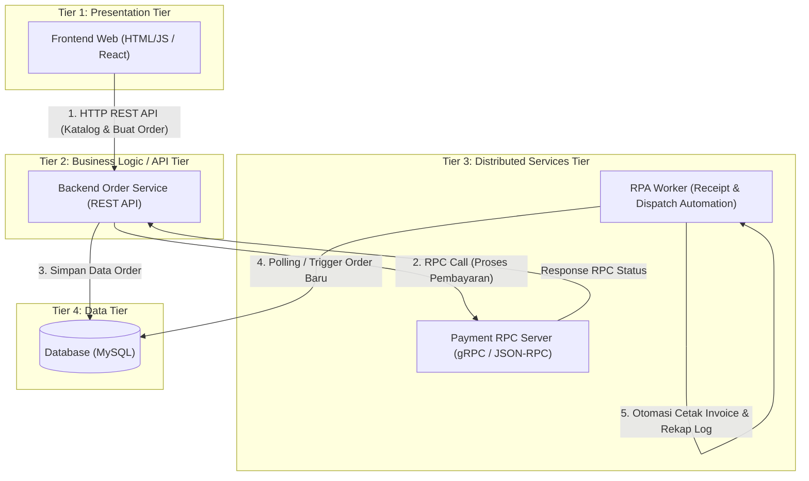

# Rencana Proyek: Sistem Food Ordering (Sistem Terdistribusi)

Dokumen ini berisi rancangan arsitektur dan spesifikasi teknis untuk tugas mata kuliah **Sistem Terdistribusi**. Sistem dirancang agar **tidak terlalu kompleks** namun **100% memenuhi 4 kriteria utama**: **API**, **RPC**, **RPA**, dan **Tiering**.

---

## 1. Ringkasan Konsep & Pemenuhan Kriteria

| Kriteria | Implementasi dalam Proyek | Deskripsi Sederhana |
| :--- | :--- | :--- |
| **API (REST API)** | Client $\leftrightarrow$ Order Service (Backend) | Frontend memesan makanan via endpoint RESTful HTTP (`GET /menu`, `POST /orders`, `GET /orders/:id/status`). |
| **RPC (Remote Procedure Call)** | Order Service $\leftrightarrow$ Payment/Billing Service | Pemanggilan fungsi jarak jauh (RPC) untuk memproses pembayaran atau pengecekan saldo secara sinkron (`ProcessPayment(order_id, amount)`). |
| **RPA (Robotic Process Automation)** | Order Dispatcher & Invoice Bot | Robot/worker otomatis tanpa intervensi manusia yang memonitor order baru, membuat invoice/struk digital, dan mencatat rekap ke spreadsheet/portal eksternal. |
| **Tiering (N-Tier Architecture)** | Pemisahan 3 atau 4 Tier terisolasi | Lapisan Presentation (Frontend), Logic (API Gateway/Backend), Services (RPC & RPA Worker), dan Data (Database). |

---

## 2. Diagram Arsitektur Terdistribusi (Mermaid)



---

## 3. Penjelasan Detail Setiap Komponen

### A. Presentation Tier (Tier 1)
- **Teknologi**: React (Vite).
- **Fungsi**:
  - Menampilkan daftar menu makanan.
  - Memilih item dan checkout order.
  - Menampilkan status order (Pending $\rightarrow$ Paid $\rightarrow$ Processed).

### B. Business Logic / API Tier (Tier 2)
- **Teknologi**: Node.js (Express).
- **Fungsi**:
  - Menyediakan REST API untuk client frontend.
  - Mengelola validasi pesanan.
  - Bertindak sebagai **RPC Client** yang memanggil *Payment Service*.
  - Menyimpan status transaksi ke database.

### C. Distributed Services Tier (Tier 3)
1. **RPC Service (Payment / Billing Service)**:
   - **Protokol**: JSON-RPC (menggunakan library `jayson`).
   - **Tugas**: Berjalan sebagai service independen di port terpisah (misal port `4000`). Menerima panggilan method:
     ```protobuf
     service PaymentService {
       rpc ProcessPayment (PaymentRequest) returns (PaymentResponse);
     }
     ```
   - Mengembalikan respon berhasil/gagal secara langsung ke Order Service.

2. **RPA Bot (Robotic Process Automation)**:
   - **Teknologi**: Node.js script (background daemon dengan polling interval).
   - **Skenario Otomasi**:
     - Bot berjalan secara background (daemon).
     - Saat ada pesanan dengan status `PAID`, bot otomatis:
       1. Mengambil detail pesanan dari sistem.
       2. Men-generate PDF Struk/Invoice pesanan secara otomatis.
       3. Meng-update file spreadsheet rekap penjualan harian (`rekap_order.csv` / Excel).
       4. Mengubah status order menjadi `COMPLETED` tanpa bantuan manusia.

### D. Data Tier (Tier 4)
- **Teknologi**: MySQL.
- **Tabel Sederhana**:
  - `menus` (`id`, `name`, `price`, `stock`)
  - `orders` (`id`, `customer_name`, `total_amount`, `status`, `created_at`)
  - `order_items` (`id`, `order_id`, `menu_id`, `quantity`)

---

## 4. Alur Kerja Sistem (Step-by-Step Flow)

1. **User Memesan (API)**:
   - User memilih menu di frontend, lalu klik **"Bayar & Pesan"**.
   - Frontend mengirim request `POST /api/orders` ke Backend.

2. **Pemrosesan Jarak Jauh (RPC)**:
   - Backend Order Service memanggil fungsi jarak jauh di Payment Service melalui **RPC**:
     `PaymentClient.ProcessPayment(orderId, amount)`.
   - Payment Service memvalidasi dan membalas dengan status sukses (`TRANSACTION_APPROVED`).

3. **Penyimpanan Data (Tiering - Data Tier)**:
   - Backend menyimpan data order ke Database dengan status `PAID`.
   - Backend membalas response ke Frontend bahwa pesanan diterima.

4. **Eksekusi Otomatis (RPA)**:
   - RPA Bot mendeteksi order baru berstatus `PAID`.
   - RPA Bot otomatis memproses:
     - Membuat dokumen nota belanja (PDF/Invoice).
     - Memasukkan data transaksi ke file rekap log harian.
     - Memperbarui status pesanan menjadi `FINISHED` / `DISPATCHED`.

---

## 5. Rekomendasi Tech Stack (Ringan & Cepat Dibuat)

- **Frontend**: React (Vite).
- **Backend API**: Node.js (Express).
- **RPC Service**: Node.js (`jayson` JSON-RPC library).
- **RPA Worker**: Node.js (background daemon + file generator).
- **Database**: MySQL.

---

## 6. Struktur Direktori yang Disarankan

```text
tugas/
├── plant.md                  # Dokumentasi rencana proyek ini
├── frontend/                 # Tier 1: Presentation
│   ├── index.html
│   ├── style.css
│   └── app.js
├── backend/                  # Tier 2: API & Gateway
│   ├── server.js             # REST API server (Express)
│   ├── rpc_client.js         # Client pemanggil RPC
│   ├── db.js                 # Koneksi MySQL
│   └── package.json
├── services/                 # Tier 3: Distributed Services
│   ├── rpc_payment/          # RPC Server
│   │   ├── server.js         # Server JSON-RPC pembayaran
│   │   └── package.json
│   └── rpa_worker/           # RPA Bot
│       ├── bot.js            # Worker pembuat struk & rekap otomatis
│       ├── package.json
│       └── output_invoices/  # Hasil cetak invoice otomatis
└── MySQL Server              # Tier 4: Data Tier (berjalan di port 3306)
```

---

## 7. Nilai Plus untuk Presentasi Dosen

1. **Demonstrasi Live**:
   - Tunjukkan terminal saat Backend memanggil RPC di terminal Payment Service terpisah.
   - Tunjukkan folder `output_invoices/` tiba-tiba terisi struk PDF baru secara otomatis (hasil kerja RPA Bot).
2. **Keterkaitan Konsep**:
   - Tunjukkan perbedaan mendasar antara **API** (REST/HTTP untuk web client) vs **RPC** (inter-service communication cepat antar server).
   - Tunjukkan bagaimana sistem terbagi dalam **Tier terisolasi** yang bisa dideploy di mesin berbeda.
